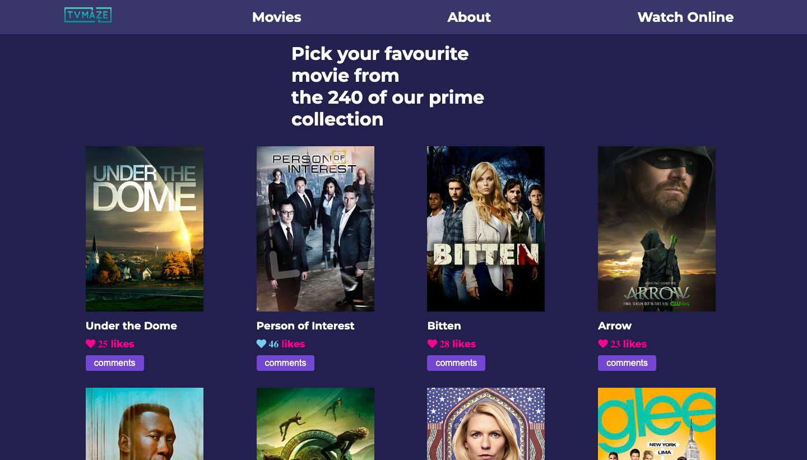
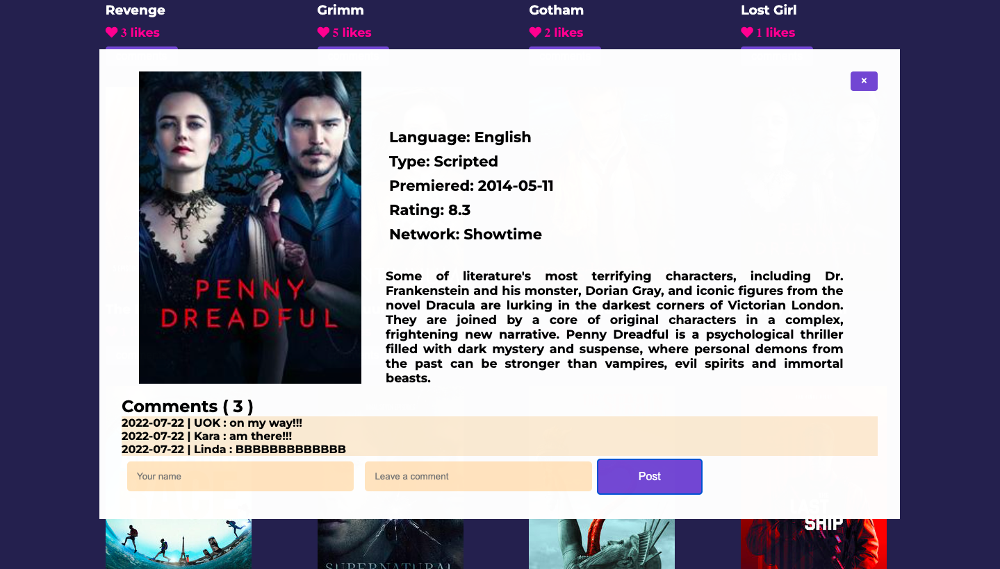

# JS-Capstone-Webapp

JavaScript capstone project - API-based webapp

> The JavaScript capstone project is about building a web application based on the external TVmaze API with two user interfaces.

## Screenshot

## Built With

- HTML
- CSS
- JavaScript
- Webpack
- Jest

## Live Demo

[Live Demo Link](https://idriss-omar-js-capstone.netlify.app/)

## Getting Started

To get a local copy up and running follow these simple example steps:

### Prerequisites

clone repo: `https://github.com/omarbabou/JS-Capstone-Webapp.git`

then
`cd JS-Capstone-Webapp`

### Install

run `npm install` to install dependencies

## Contribute

Contributions, issues, and feature requests are welcome!

Feel free to check the [issues page](https://github.com/omarbabou/JS-Capstone-Webapp/issues)

## Author

👤 **Idriss Omar**

- GitHub: [@omarbabou](https://github.com/omarbabou)
- Twitter: [@BabouOmar3](https://twitter.com/BabouOmar3)

## Acknowledgements

The authors highly appreciate the help in the project from all the participants of this week's program for the timely response to all questions from our team.

## 📝 License

This project is [MIT](./MIT.md) licensed.